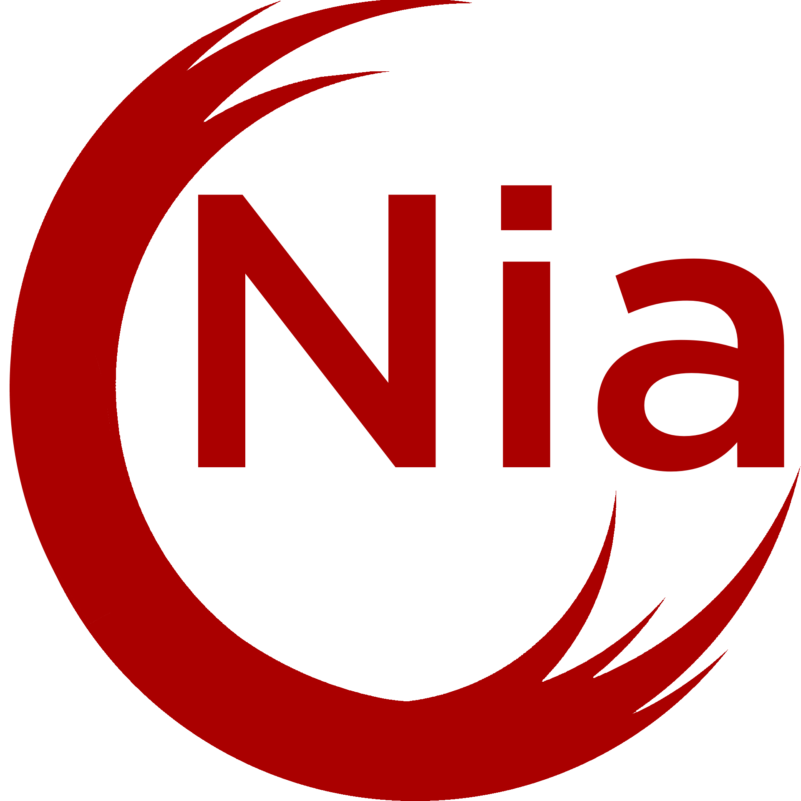

<br>
# What you need:
- Cmake 3.11 https://cmake.org/files/v3.11/ (and here is a guide to install it on linux https://peshmerge.io/how-to-install-cmake-3-11-0-on-ubuntu-16-04/)

# Build Nia using 'make'
(This is not very Windows friendly)<br>
```git clone https://github.com/streanga-sarmis/nia```<br>
```cd nia/```<br>
```make build_lib``` or ```make build_lib DEBUG=true``` for debugging version.<br>

## Now you can test the lib 
```make test```<br>

## To run manually an example, go into the example folder and type ```make run``` 

(For this to be more portable I will make a script in the future that does these, instead of using "make")<br>

# Build Nia using other methods

For debugging use '-DCMAKE_BUILD_TYPE=Debug' when using cmake<br>
## Windows

### Mingw32:
```git clone https://github.com/streanga-sarmis/nia```<br>
```cd nia/```<br>
```mkdir build```<br>
```cd build/```<br>
```cmake ../ -G "MinGW Makefiles" -DCMAKE_SH="CMAKE_SH-NOTFOUND"```<br>
```mingw32-make```<br>

### MSVC: (untested)
```git clone https://github.com/streanga-sarmis/nia```<br>
```cd nia/```<br>
```mkdir build```<br>
```cd build/```<br>
```cmake ../ -G "Visual Studio XX"```<br>
Now you should have a Visual Studio 20XX project that you can build into a shared library


### Or raw g++:
```g++ -c -DNIA_LIBRARY_BUILD src/*.cpp src/arch/win32/*.cpp -Iinclude/```<br>
```g++ -shared -o nia.dll *.o -lopengl32 -lgdi32```<br>
```g++ -o ./build/a examples/test.cpp -Lbuild/ -lnia -Iinclude/ -lopengl32```<br>

## Linux

### Use:
```git clone https://github.com/streanga-sarmis/nia```<br>
```cd nia/```<br>
```mkdir build```<br>
```cd build/```<br>
```cmake ../```<br>
```make```

### Or raw g++:
```g++ -c -DNIA_LIBRARY_BUILD ./src/*.cpp ./src/arch/win32/*.cpp ./src/arch/linux/*.cpp -fpic -I./include/```<br>
```g++ -shared -o libnia.so *.o -lX11 -lGL -lGLU```<br>
```g++ -o a ./examples/test.cpp -L. -lnia -I./include/ -lGL```<br>
```export LD_LIBRARY_PATH=/home/<your user here>/nia:$LD_LIBRARY_PATH```<br>